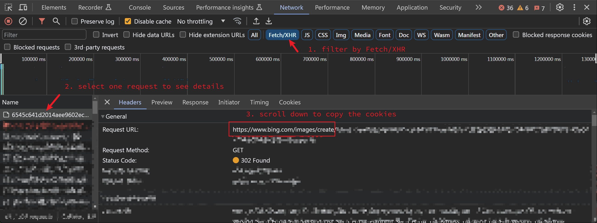

# tg_bing_dalle

Telegram bot using bing dalle-3

## Usage

Live Show: https://t.me/c/1941649644/2798

In any chat with the bot, send your message like `prompt: something` or `/prompt something` or `@bot_name something`.
You can also send your message like `/quota` or `quota?` or `@bot_name quota?` to get the limit.

Using `/prompt_pro` or `prompt_pro:` will make use of GPT to rewrite your prompt.

## How to

How to make your own DALL-E 3 bing tg bot.

### Method 1 (Run Python directly)

**Read this first if you are new to code**

1. Make sure your ip can open https://bing.com/create not jump cn.bing (can use GitHub to login)
2. Use https://bing.com/images/create create a new png, F12 in chrome to get cookie string as bing_cookie

   **_Highly recommanded to use Edge or Chrome to get the cookie, and don't use incognito/privacy mode. We encountered errors when using cookie got by Firefox._**

   

3. Get tg token, ask Google or ChatGPT, need get it from [BotFather](https://t.me/BotFather)
4. `pip install -r requirements.txt`
5. `python tg.py '${tg_token}' '${bing_cookie}'`

_You can provide multiple cookies, to increase the use limit. see:_

```
usage: tg.py [-h] [-c CONFIG_FILE] tg_token bing_cookie [bing_cookie ...]

positional arguments:
  tg_token        tg token
  bing_cookie     bing cookie

options:
  -h, --help      show this help message and exit
  -c CONFIG_FILE  additional config file
```

### Method 2 (Run from a shell script)

Or you can start with `run.sh`:

1. Save your tg token to a new `.token` file in this directory.
2. Save your cookies to a new `.cookies` file in this directory, one cookie per line.
3. `chmod +x run.sh`
4. `./run.sh`

### Method 3 (Run from Docker)

Or you can use docker to run it:

1. `docker build -t tg_bing_dalle .`
2. `docker run -d --name tg_bing_dalle -e tg_token='${tg_token}' -e bing_cookie='${bing_cookie}' --network host tg_bing_dalle`

If you want to use multiple cookies, you could save to `credentials/.cookies` with one cookie per line. Then use this command to run it:

`docker run -d --name tg_bing_dalle -e tg_token='${tg_token}' --network host --volume ./credentials/:/credentials tg_bing_dalle`

### Method 4 (Deploy to Fly.io)

1. Install [flyctl](https://fly.io/docs/getting-started/installing-flyctl/)
2. `flyctl auth login`
3. `flyctl launch`
   > [!NOTE]
   > Change the app name to your own name in fly.toml
4. `flyctl secrets set tg_token=`_your tg_token_
5. `flyctl secrets set bing_cookie=`_your bing_cookie_
6. `flyctl deploy`

If you want to use multiple cookies, you just need to set the key of secrets to start with `bing_cookie`. For example:

`flyctl secrets set bing_cookie_0=`_your bing_cookie_0_  

## Advanced

### GPT Enhance

To enable `prompt_pro`, copy `config.sample.toml` to `config.toml`, and edit the file to setup your OpenAI API.

Then add the option `-c config.toml` to start the server.
```python
python tg.py '${tg_token}' '${bing_cookie}' -c config.toml
```

### @bot

To enable `@bot_name ${prompts}`. you can either disable [privacy mode](https://core.telegram.org/bots/features#privacy-mode) or add the bot as a Group Admin (not recommended for public groups). 
Please note that this may decrease the efficiency of the bot since it will have to process all messages in the group, potentially overloading the server running it.

## Contribution

- Any issue reports or PRs are welcome.
- Any other bot type like slack/discord welcome
- Before PR, use `pip install -U black` then `black .` first

## Appreciation

- Thank you, that's enough. Just enjoy it.
